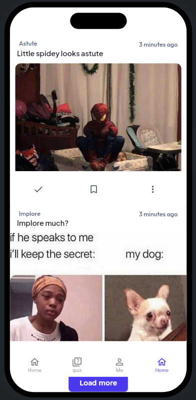
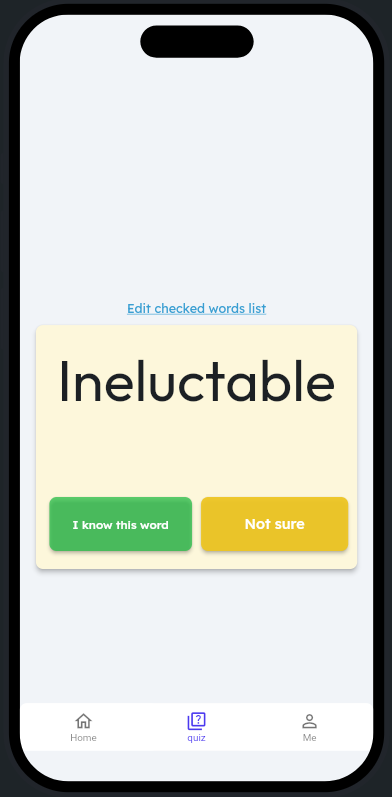
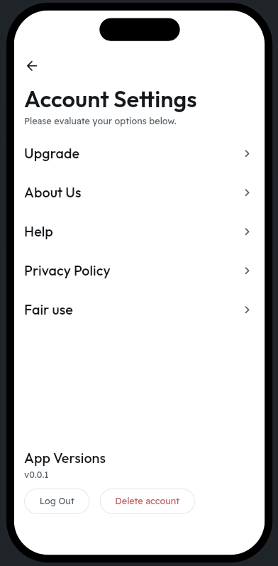
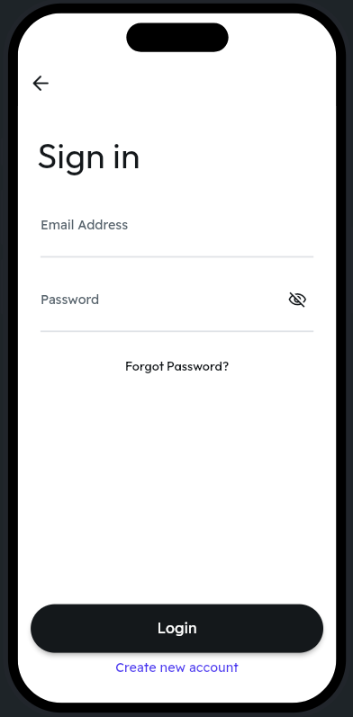

# Roteless

 
 

*Home screen displaying mnemonic memes.* &nbsp;&nbsp;&nbsp; *Meme detail view with generated mnemonic.*


## Table of Contents
- [Overview](#overview)
- [Features](#features)
- [Screenshots](#screenshots)
- [Getting Started](#getting-started)
  - [Prerequisites](#prerequisites)
  - [Installation](#installation)
  - [Running the Application](#running-the-application)
- [Configuration](#configuration)
- [Project Structure](#project-structure)
- [Contributing](#contributing)
- [License](#license)
- [Contact](#contact)

## Overview

**Roteless** is a Flutter-based application designed to enhance vocabulary acquisition by converting memes into mnemonic devices using generative AI. The app fetches memes from Reddit, incorporates vocabulary into the captions using LLMs, and presents it in an engaging and interactive manner on both Android and Web platforms.

## Features

- **Cross-Platform Support**: Runs seamlessly on Android devices and Flutter Web.
- **Generative AI Integration**: Utilizes OpenAI to generate mnemonic captions for memes.
- **Firebase Integration**: Fetches and displays processed meme posts from Firebase.
- **User-Friendly Interface**: Intuitive design for easy navigation and interaction.
- **Real-Time Updates**: Automatically updates with new mnemonic posts without requiring manual refresh.

## Screenshots


*Home screen displaying mnemonic memes.*


*Meme detail view with generated mnemonic.*

## Getting Started

### Prerequisites

Before you begin, ensure you have met the following requirements:

- **Flutter SDK**: [Install Flutter](https://flutter.dev/docs/get-started/install) (version 3.0 or higher recommended)
- **Dart SDK**: Comes bundled with Flutter
- **Firebase Project**: Set up a Firebase project and obtain the configuration files
- **OpenAI API Key**: Obtain an API key from [OpenAI](https://openai.com/api/)
- **Android Studio or VS Code**: Recommended IDEs for Flutter development
- **Web Browser**: For running the web version

### Installation

1. **Clone the Repository**

   ```bash
   git clone https://github.com/yourusername/roteless.git
   cd roteless/frontend/roteless_flutter_app
   ```

2. **Install Dependencies**

   Ensure you are in the `roteless_flutter_app` directory.

   ```bash
   flutter pub get
   ```

3. **Configure Firebase**

   - **Android**:
     - Download the `google-services.json` file from your Firebase project settings.
     - Place it in the `android/app/` directory.

   - **Web**:
     - In your Firebase project settings, locate the Firebase SDK snippet for the web.
     - Replace the placeholder configuration in `lib/firebase_options.dart` with your actual Firebase config.

4. **Configure Environment Variables**

   Create a `.env` file in the root of `roteless_flutter_app` and add your Firebase and OpenAI configurations.

   ```env
   FIREBASE_API_KEY=your_firebase_api_key
   FIREBASE_AUTH_DOMAIN=your_project_id.firebaseapp.com
   FIREBASE_PROJECT_ID=your_project_id
   FIREBASE_STORAGE_BUCKET=your_project_id.appspot.com
   FIREBASE_MESSAGING_SENDER_ID=your_messaging_sender_id
   FIREBASE_APP_ID=your_app_id
   OPENAI_API_KEY=your_openai_api_key
   ```

   **Note**: Ensure `.env` is listed in your `.gitignore` to prevent sensitive information from being exposed.

### Running the Application

#### Android

1. **Connect an Android Device** or start an Android emulator.

2. **Run the App**

   ```bash
   flutter run
   ```

#### Web

1. **Enable Web Support**

   If not already enabled, run:

   ```bash
   flutter config --enable-web
   ```

2. **Run the App on Web**

   ```bash
   flutter run -d chrome
   ```

## Configuration

### Firebase

Ensure that Firebase is correctly configured for both Android and Web platforms. Refer to the [Firebase Flutter documentation](https://firebase.flutter.dev/docs/overview/) for detailed setup instructions.

### OpenAI

The frontend interacts with the backend to fetch processed meme posts. Ensure the backend is properly set up and running, and that it has access to the OpenAI API.

## Project Structure

```
roteless/
├── frontend/
│   ├── roteless_flutter_app/
│   │   ├── android/
│   │   ├── ios/
│   │   ├── lib/
│   │   │   ├── models/
│   │   │   ├── services/
│   │   │   ├── screens/
│   │   │   ├── widgets/
│   │   │   ├── main.dart
│   │   │   └── firebase_options.dart
│   │   ├── web/
│   │   ├── assets/
│   │   ├── test/
│   │   ├── pubspec.yaml
│   │   ├── .env
│   │   └── README.md
│   └── README.md
└── README.md
```

## Contributing

Contributions are welcome! Please follow these steps:

1. **Fork the Repository**

2. **Create a Feature Branch**

   ```bash
   git checkout -b feature/YourFeature
   ```

3. **Commit Your Changes**

   ```bash
   git commit -m "Add some feature"
   ```

4. **Push to the Branch**

   ```bash
   git push origin feature/YourFeature
   ```

5. **Open a Pull Request**

## License

This project is licensed under the [MIT License](./LICENSE).

## Contact

For any questions or suggestions, please contact:

- **Your Name** - [@yourtwitter](https://twitter.com/yourtwitter)
- **Email**: your.email@example.com

---

*Happy Learning with Roteless!*
```

---

## Backend README (`backend/README.md`)

```markdown
# Roteless Backend

 <!-- Replace with your actual logo path -->

## Table of Contents
- [Overview](#overview)
- [Features](#features)
- [Architecture](#architecture)
- [Getting Started](#getting-started)
  - [Prerequisites](#prerequisites)
  - [Installation](#installation)
  - [Configuration](#configuration)
  - [Running the Backend](#running-the-backend)
- [Project Structure](#project-structure)
- [Testing](#testing)
- [Logging](#logging)
- [Contributing](#contributing)
- [License](#license)
- [Contact](#contact)

## Overview

The **Roteless Backend** is a Python-based system designed to automate the process of fetching memes from Reddit, generating mnemonic captions using OpenAI's GPT-4, and storing the processed posts in Firebase. This backend serves data to the Roteless Flutter frontend, enhancing vocabulary acquisition through engaging and memorable content.

## Features

- **Reddit Scraping**: Automatically fetches memes from specified subreddits using PRAW.
- **Generative AI Integration**: Utilizes OpenAI's GPT-4 to create mnemonic captions for memes.
- **Firebase Integration**: Stores and manages processed posts in Firebase Firestore.
- **Duplicate Checking**: Ensures that only new and unique posts are processed and stored.
- **Logging**: Comprehensive logging for monitoring and debugging.
- **Configuration Management**: Centralized configuration for easy adjustments.
- **Modular Architecture**: Organized codebase for maintainability and scalability.
- **Testing**: Unit tests to ensure reliability of individual components.

## Architecture

```
roteless/
├── backend/
│   ├── src/
│   │   ├── config/
│   │   │   └── config.py
│   │   ├── firebase/
│   │   │   └── firebase_handler.py
│   │   ├── reddit/
│   │   │   └── reddit_client.py
│   │   ├── openai_client/
│   │   │   └── openai_client.py
│   │   ├── utils/
│   │   │   ├── json_utils.py
│   │   │   └── logger.py
│   │   └── main.py
│   ├── tests/
│   │   ├── test_reddit_client.py
│   │   ├── test_firebase_handler.py
│   │   └── test_openai_client.py
│   ├── requirements.txt
│   ├── .env
│   └── README.md
└── README.md
```

## Getting Started

### Prerequisites

Ensure you have the following installed on your system:

- **Python 3.8+**: [Download Python](https://www.python.org/downloads/)
- **pip**: Comes bundled with Python
- **Virtual Environment Tool**: `venv`, `pipenv`, or `poetry`
- **Firebase Account**: Set up a Firebase project and obtain service account credentials
- **Reddit API Credentials**: Register an application to obtain `client_id`, `client_secret`, and `user_agent`
- **OpenAI API Key**: Obtain an API key from [OpenAI](https://openai.com/api/)

### Installation

1. **Clone the Repository**

   ```bash
   git clone https://github.com/yourusername/roteless.git
   cd roteless/backend
   ```

2. **Set Up a Virtual Environment**

   Using `venv`:

   ```bash
   python3 -m venv venv
   source venv/bin/activate  # On Windows: venv\Scripts\activate
   ```

3. **Install Dependencies**

   ```bash
   pip install -r requirements.txt
   ```

### Configuration

1. **Environment Variables**

   Create a `.env` file in the `backend/` directory and add the following configurations:

   ```env
   # Reddit API Credentials
   REDDIT_CLIENT_ID=your_reddit_client_id
   REDDIT_CLIENT_SECRET=your_reddit_client_secret
   REDDIT_USER_AGENT=RotelessBot/0.1 by your_username

   # OpenAI API
   OPENAI_API_KEY=your_openai_api_key

   # Firebase
   FIREBASE_CREDENTIALS=path/to/roteless-vgtppm-firebase.json

   # Subreddits to Fetch
   SUBLIST=sub1,sub2,sub3

   # Prompts
   IMAGE_PROMPT=Describe the image: 
   FULL_PROMPT=Generate a caption: 
   ```

2. **Firebase Credentials**

   - Download the `roteless-vgtppm-firebase.json` file from your Firebase project settings.
   - Place it in the `backend/` directory or a secure location of your choice.
   - Update the `FIREBASE_CREDENTIALS` path in the `.env` file accordingly.

### Running the Backend

Ensure your virtual environment is activated.

```bash
python src/main.py
```

For a timed run with detailed logging:

```bash
python src/main.py
```

**Note**: The `main.py` script is configured to execute the `timed_run` function, which fetches, processes, and uploads posts.

## Project Structure

```
backend/
├── src/
│   ├── config/
│   │   ├── __init__.py
│   │   └── config.py
│   ├── firebase/
│   │   ├── __init__.py
│   │   └── firebase_handler.py
│   ├── reddit/
│   │   ├── __init__.py
│   │   └── reddit_client.py
│   ├── openai_client/
│   │   ├── __init__.py
│   │   └── openai_client.py
│   ├── utils/
│   │   ├── __init__.py
│   │   ├── json_utils.py
│   │   └── logger.py
│   └── main.py
├── tests/
│   ├── __init__.py
│   ├── test_reddit_client.py
│   ├── test_firebase_handler.py
│   └── test_openai_client.py
├── requirements.txt
├── .env
└── README.md
```

### Directory Breakdown

- **src/**: Contains the main source code.
  - **config/**: Centralized configuration management.
  - **firebase/**: Firebase interaction logic.
  - **reddit/**: Reddit scraping and data fetching.
  - **openai_client/**: OpenAI API interactions.
  - **utils/**: Utility modules for JSON handling and logging.
  - **main.py**: Entry point for running the backend processes.
- **tests/**: Unit and integration tests for backend modules.
- **requirements.txt**: Python dependencies.
- **.env**: Environment variables (ensure this is added to `.gitignore`).
- **README.md**: Documentation for the backend.

## Testing

Unit tests are located in the `tests/` directory. To run the tests:

1. **Ensure the Virtual Environment is Activated**

   ```bash
   source venv/bin/activate  # On Windows: venv\Scripts\activate
   ```

2. **Install Testing Dependencies**

   If not already included in `requirements.txt`, ensure `unittest` or other testing frameworks are installed.

3. **Run Tests**

   ```bash
   python -m unittest discover -s tests
   ```

   **Example Output:**

   ```bash
   ...
   ----------------------------------------------------------------------
   Ran 3 tests in 0.123s

   OK
   ```

## Logging

Logging is implemented using Python’s built-in `logging` module. Logs are stored in `roteless.log` located in the `backend/` directory.

### Log Levels

- **INFO**: General operational messages.
- **WARNING**: Indications of potential issues.
- **ERROR**: Errors that prevent certain operations from completing.

### Accessing Logs

View the log file to monitor backend operations and debug issues.

```bash
tail -f roteless.log
```

## Contributing

Contributions are highly appreciated! To contribute, please follow these steps:

1. **Fork the Repository**

2. **Create a Feature Branch**

   ```bash
   git checkout -b feature/YourFeature
   ```

3. **Commit Your Changes**

   ```bash
   git commit -m "Add some feature"
   ```

4. **Push to the Branch**

   ```bash
   git push origin feature/YourFeature
   ```

5. **Open a Pull Request**

Please ensure that your code adheres to the project's coding standards and that all tests pass.

## License

This project is licensed under the [MIT License](./LICENSE).
